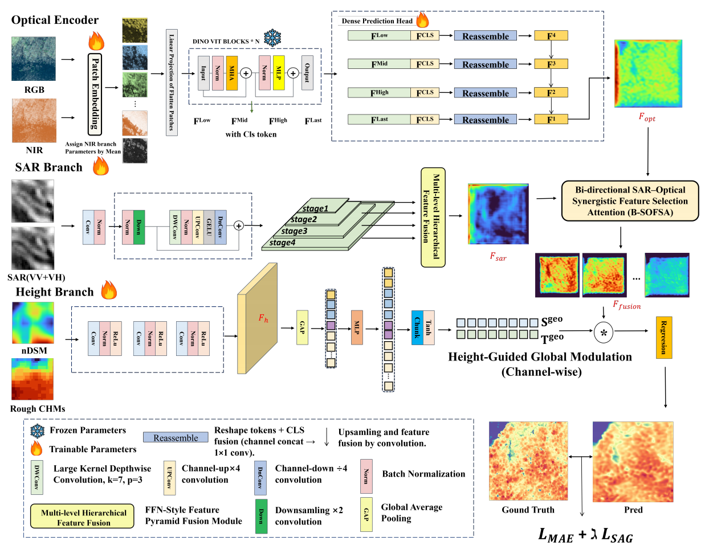
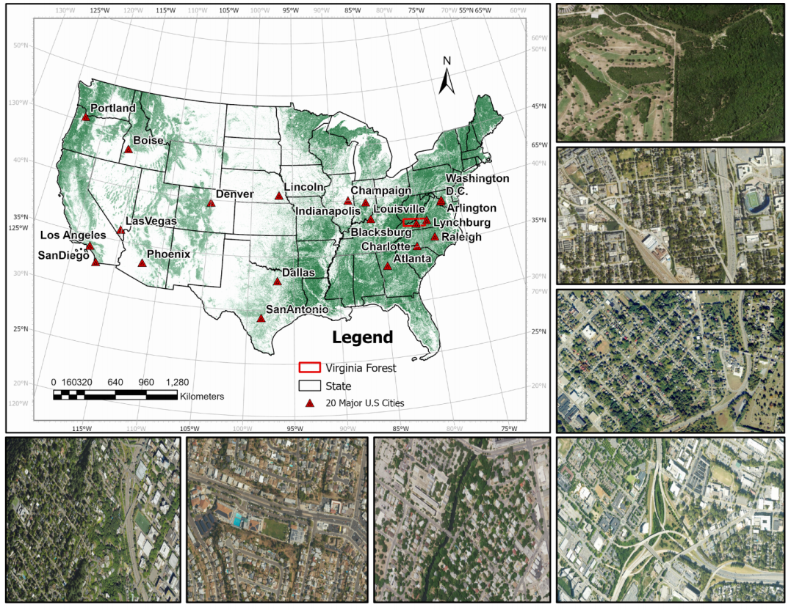
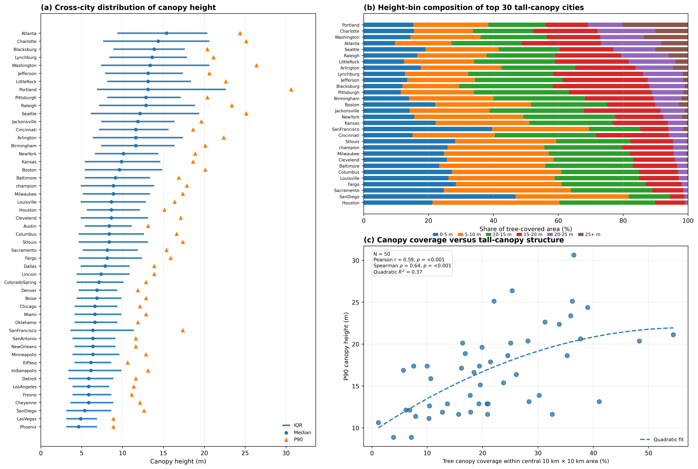

# TreeFusion v1.0

**TreeFusion v1.0** is a DINOv3-based multimodal deep learning framework and data product for very-high-resolution urban tree canopy height mapping and vegetation mask generation.

TreeFusion is designed for urban forest analysis, where fragmented canopy patterns, complex background conditions, and strong local variability make reliable canopy height mapping challenging. The framework integrates optical imagery, SAR observations, and height-related priors to improve canopy structure estimation in heterogeneous urban environments.

---

## Project Structure

```text
TreeFusion/
├── models/
│   ├── TreeDinoHeightAtt.py   # Main canopy height model
│   ├── TreeDinoSeg.py         # Vegetation mask model
│   ├── OpticalEncoder.py      # Optical feature encoder
│   ├── SarEncoder.py          # SAR feature encoder
│   ├── utils.py               # Model components
│   └── train_utils.py         # Utility functions
├── datasat_multi/
│   └── datasatKD_8Chanel.py   # Dataset loader
├── dinov3/                    # DINOv3 source code
├── weights/
├── checkpoints/
├── train.py
├── test_OpenTree400k.py
├── hubconf.py
├── requirements.txt
├── conda.yaml
├── LICENSE.md
└── README.md
```

This repository contains the core model implementation, dataset interface, and evaluation workflow for TreeFusion v1.0.

---

## Visual Overview

### Model Overview

<p align="center">
  
</p>

**Figure 1.** Overview of the TreeFusion framework. TreeFusion adopts a three-branch multimodal design to combine optical semantics, SAR-derived structural information, and height-related priors. The optical branch is built on DINOv3, while the SAR and height branches provide complementary structural and geometric context for canopy height estimation in heterogeneous urban scenes.

---

### Study Area

<p align="center">
  
</p>

**Figure 2.** Study areas used for TreeFusion model development and evaluation. The benchmark includes 20 major U.S. cities spanning diverse vegetation distributions, urban forms, and environmental conditions. A Virginia forest region is also included as an auxiliary area for transferability assessment.

---

### Cross-city Canopy Height Statistics

<p align="center">
  
</p>

**Figure 3.** Cross-city canopy height statistics for the 50 U.S. cities generated by TreeFusion v1.0. The comparison shows strong heterogeneity in urban forest structure, including differences in median height, upper-canopy height, and tall-canopy composition. Vegetation-rich cities generally show taller and more diverse canopy structures, while arid western cities tend to have shorter and more compact canopy height distributions.

---

## TreeFusion v1.0 Data Product

TreeFusion v1.0 was further extended to generate two geospatial products for the core urban regions of 50 U.S. cities: **Canopy Height Map** and **Vegetation Mask**. The data product is available on Zenodo: https://zenodo.org/records/20192536

Reported performance:

```text
OpenTree400k:
MAE = 2.09 m
R²  = 0.78

Independent NEON ALS validation:
MAE = 2.04 m
R²  = 0.71
```

---

## Acknowledgements

TreeFusion builds upon the DINOv3 vision foundation framework and benefits from the open research ecosystem around self-supervised visual representation learning. We sincerely acknowledge the DINOv3 team and related open-source contributors for releasing their models and codebase.

If you use TreeFusion in your research, please cite both this project and the relevant DINOv3 work. Please also follow the official DINOv3 paper, repository, and license requirements when using DINOv3-based components or pretrained weights.

The latest citation link will be updated after the manuscript or data product is formally released.

---

## License

This project is released under the license provided in `LICENSE.md`. Please also follow the license requirements of DINOv3 and any third-party pretrained weights used in this project.

---

## Contact

For questions about the project, please contact: taige@vt.edu.

The code comments and README text were polished with assistance from ChatGPT and manually reviewed by the authors.